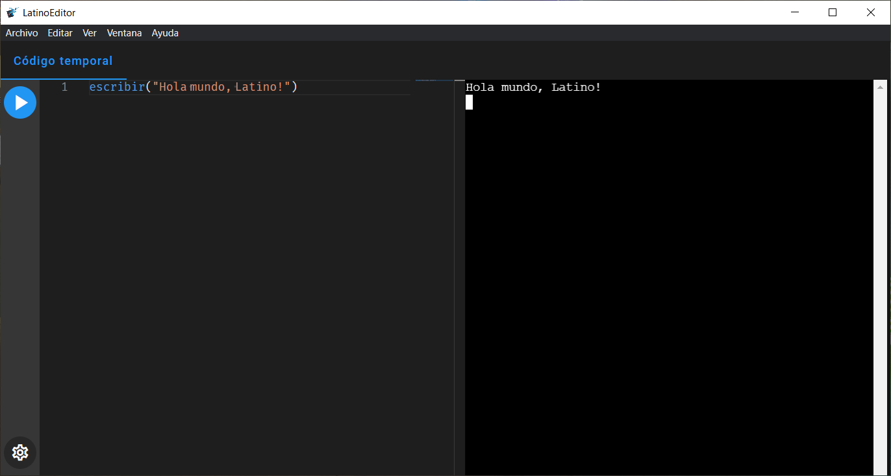

# Latino Editor - ("Desktop App")

## Sobre el editor

Editor de código para el [Lenguaje Latino](https://www.lenguajelatino.org/), versión web [editor-enlinea](https://editor.lenguajelatino.org/) desarrollado por [Melvin Guerrero](https://github.com/MelvinG24).

Este editor de código ~~no~~ **es oficial**, y es desarrollado por [Enzo Notario](https://enzonotario.me).

## Editor Latino
<!--  -->

### Características

* Multi-plataformas
* Reconocedor de sintaxis de Latino
* Ejecución del código de Latino en la terminal sin la necesidad de tener Latino instalado

## Descargar

### Windows
> Para ejecutar el código en LatinoEditor, es necesario instalar previamente el [Lenguaje Latino](https://github.com/MelvinG24/Latino/releases/download/v1.4.1/Latino-1.4.1-Win.exe).

- Descargar para [Windows (versión portable)](https://github.com/enzonotario/latino-editor/releases/download/v0.0.1-alpha.0/LatinoEditor.0.0.1-alpha.0.exe)
- Descargar para [Windows (instalador)](https://github.com/enzonotario/latino-editor/releases/download/v0.0.1-alpha.0/LatinoEditor.Instalador.0.0.1-alpha.0.exe)

### Linux
- Descargar para [Linux (AppImage)](https://github.com/enzonotario/latino-editor/releases/download/v0.0.1-alpha.0/LatinoEditor-0.0.1-alpha.0.AppImage)
- Descargar para [Linux (snap)](https://github.com/enzonotario/latino-editor/releases/download/v0.0.1-alpha.0/latino-editor_0.0.1-alpha.0_amd64.snap)
- Descargar para [Linux (deb)](https://github.com/enzonotario/latino-editor/releases/download/v0.0.1-alpha.0/latino-editor_0.0.1-alpha.0_amd64.deb)

### MacOS
> Aun no se dispone de un binario

## Documentación

LatinoEditor sólo permite ejecutar código Latino. Para más información sobre el Lenguaje Latino, dirigirse al [Manual de Latino](https://manual.lenguajelatino.org/es/stable/).

## Contribuciones

Toda buena contribución es bienvenida. Hay varias maneras en las cuales puedes participar en este proyecto, como por ejemplo:

* [Reportando errores y agregando nuevas sugerencias](https://github.com/lenguaje-latino/latino-editor/issues)
* Revisando los cambios sugeridos en el [Pull requests](https://github.com/lenguaje-latino/latino-editor/pulls)

Si deseas contribuir en este proyecto proponiendo sugerencias o aportando al código fuente, te dejamos el siguiente enlace:

* [Como compilar Latino-editor](https://github.com/lenguaje-latino/latino-editor/blob/main/.readme/Como_Compilar.md)

## Licencia
Licenciado bajo la licencia [MIT](https://github.com/lenguaje-latino/latino-editor/blob/main/LICENSE)
