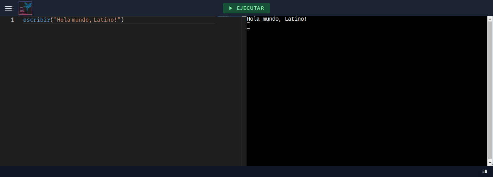

# LatinoEditor

https://editor.lenguajelatino.org/

Editor de código Latino online, desarrollado por [Enzo Notario](https://enzonotario.me), en colaboración de [Melvin Guerrero](https://github.com/MelvinG24).

<!--  -->

## Características

* Editor en línea, capaz de ejecutarse en cualquier navegador web moderno.
* Reconocedor de sintaxis de Latino.
* Ejecución del código de Latino en la terminal, sin necesidad de tener Latino instalado.

## Documentación

LatinoEditor sólo permite ejecutar código Latino. Para más información sobre el Lenguaje Latino, dirigirse al [Manual de Latino](https://manual.lenguajelatino.org/es/stable/).

## Contribuciones

Toda contribución es bienvenida! Puedes participar en el proyecto de diferentes maneras:

* [Reportando errores y agregando nuevas sugerencias](https://github.com/lenguaje-latino/latino-editor/issues).
* Revisando los cambios sugeridos en los [Pull Requests](https://github.com/lenguaje-latino/latino-editor/pulls).
* Contribuyendo al código de LatinoEditor, siguiendo la siguiente [Guía de Contribución](.github/contributing.md).

## Licencia
Licenciado bajo la licencia [MIT](https://github.com/lenguaje-latino/latino-editor/blob/main/LICENSE).
